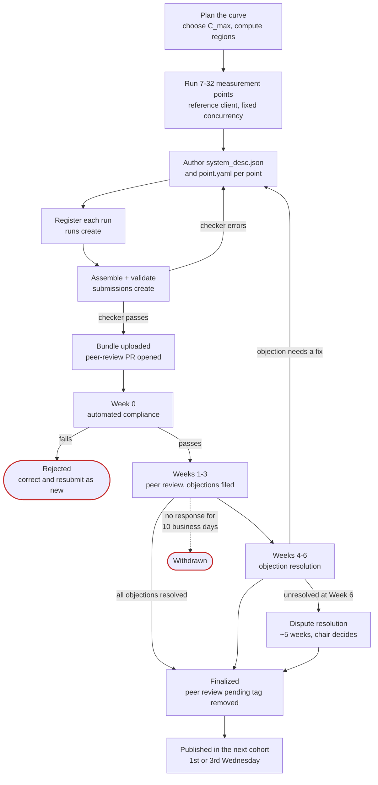

# How submission works

What you do, what MLCommons does, what reviewers do, and when your results become public.

## Overview

## Rolling submission and cohorts

There is no submission deadline. Submit on any day; the submission is timestamped on receipt and
enters the pipeline immediately.

Results publish every two weeks, on the 1st and 3rd Wednesday of each month at 08:00 Pacific.
These batches are called cohorts: `YYYY-MM-C0` for the 1st Wednesday, `YYYY-MM-C1` for the 3rd.

To make a cohort, your submission has to **pass automated compliance at least one business day
before** that Wednesday. If it doesn't, it moves to the next cohort. Review timelines count from the
cohort your submission first appears in, not from the day you uploaded it.

## The review phases

| Phase | Window | What happens |
|---|---|---|
| **Automated compliance** | Week 0 (may finish in a day) | The checker runs server-side. Any failure by end of Week 0 **rejects** the submission — you correct and resubmit as a *new* submission. |
| **Peer review** | Weeks 1–3 | Committee members examine artifacts and file objections as GitHub issues. **No new objections after end of Week 3.** Resolve everything here and you qualify for early finalization. |
| **Objection resolution** | Weeks 4–6 | Carried-over objections must be resolved. Chairs may call a meeting if an objection is 12+ business days old. |
| **Dispute resolution** | From Week 6, ~5 weeks | Automatic escalation for anything still open. Chair issues a binding decision; 8-week backstop. |

### Your response deadline

This is easy to miss. Once someone files an objection against your submission:

- You must post an **initial response within 3 business days**, either acknowledging with a
  resolution schedule, or contesting with evidence. Local public holidays in your primary operating
  jurisdiction do not count against the window.
- The objector then has 2 business days to accept, retract, or carry the objection forward.

If you don't respond, penalties apply automatically. They add up and can't be reversed:

| Business days without your response | Penalty |
|---|---|
| 3 | Finalization delayed by **1 cohort** |
| 6 | Delayed by **2 cohorts** |
| 10 | Submission is **withdrawn** |

Responding later won't undo a penalty you've already triggered, though it does stop things getting
worse. See [After you submit](../workflow/after-submission.md).

## Who reviews you

The review committee for a cohort comes from organisations that have at least one *finalized*
MLPerf Endpoints result in the previous 6 months or 12 cohorts, whichever is longer. Each new
submission also gets one assigned reviewer, picked at random from that pool. Your own organisation
is excluded.

Being a competitor is **not** a conflict of interest. The whole model is built on competitors
reviewing each other. Neither are CSP/OEM/ODM partnerships. Conflicts mean things like direct
financial interest in the outcome or an employment relationship.

## When your results become public

By default, review is **fully confidential**: results and artifacts are visible to the review
committee and other submitters, but not to the public until review completes.

Alternatively you can **opt in to provisional publication** when you submit. Your results publish
before peer review finishes, tagged **"peer review pending"**. This is useful if you need results in
time for a launch or conference. Two things to know:

- You **can't change your mind** later. If you don't opt in at submission time, you can't request it
  afterwards.
- Anyone quoting a "peer review pending" result — you, MLCommons or the press — has to include the
  MLCommons footnote saying results are preliminary and may change.

Either way, you can set an **embargo date**. For confidential submissions this holds back finalized
results for up to 60 days after review completes. For provisional submissions it holds back when the
tagged result first appears. You can change the date later, but all review committee members are
told when you do.

| Group | During review | After finalization |
|---|---|---|
| Review committee | All results, code and artifacts | All |
| Other submitters | All results, code and artifacts | All |
| Public | Nothing, unless you opted in — then tagged results only, no code | Everything |

## After publication

You can't edit published results. If you find an error in a finalized result, the affected points
or the whole submission get invalidated instead. Fixing documentation or metadata is possible, but
needs review-chair approval and publishes with a change log.

Other people can challenge your published result until the **later** of the next audit vote or **90
days** after finalization. After that it's settled. You need to keep the benchmarked system
available for a possible audit until that window closes.

**Next:** [Divisions and scenarios](divisions-and-scenarios.md)

--8<-- "precedence-notice.md"

*Last verified against: `mlcommons/endpoints_policies@v1.0_rules_dev` (a7ec3cc), 2026-09-19.*
